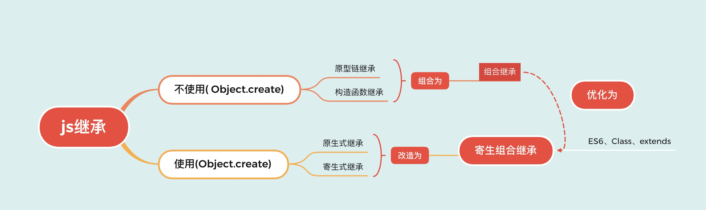

### js的继承



#### 1.1 原型链继承 

<p style="color: red;"> 将父类的实例作为子类的原型</p> 

```javascript

	Subtype.prototype = new SuperType();
	Subtype.prototype.constructor = Subtype

```

优点：
	父类方法可以服用

缺点：
		1, 父类的引用属性会被所有自雷实例共享
		2, 子类构建父类实例时不能向父类传递参数


#### 构造函数式继承

<p style="color:red;"> 将父类构造函数的内容复制给子类的构造函数</p>

``` javascript
	
	function SuperType() {
		 this.color = [ 'red', 'green', 'yellow']
	}

	function SubType() {
		SuperType.call(this)
	}

	const instance = new SubType()
	instance.color.push('black')
	alert(instance.color) // ['red', 'green', 'yellow', block']

	const instance1 = new SubType()
	alert(instance1.color) // ['red', 'green', 'yellow']

```

优点：

1. 父类的方法可以被复用

2. 父类的引用属性不会被共享

3. 子类构建实例时可以想父类传递参数


缺点：

调用了两次父类的构造函数


#### 组合继承

```javascript

	function SuperType() {
		this.name ='created'
		this.arr = [1,2,3]
	}

	SuperType.prototype.say = function() {
		console.log('this is parent')
	}

	function SubType() {
		SuperType.call(this)
	}

	SubType.prototype = new SuperType();
```


#### 原型式继承

<p style="color: red;"> 原型式继承的object方法本质上市对参数对象的一个浅复制, (有一个对象作为另一个对象的基础)</p>


```javascript

	function object(o) {
		function F() {}
		F.prototype = o;
		return new F();
	}

```

#### 寄生式继承

<p style="color: red;"> 使用原型式继承获得一个目标对象的浅复制</p>

```javascript

	function createAnother(original) {
		 let clone = object(original);
		 clone.sayHi = function () {
			 alert('hi)
		 }
		 return clone;
	}

	let person = {
		name: 'Nicholas',
		friends: ['shelby', 'court', 'van']
	}

	var anotherPerson = createAnother(person)
	anotherPerson.sayHi()

```

#### 寄生组合继承

<p style="color: red;">使用</p>

```javascript

	function inheritPrototype(subType, superType) {
		var prototype = object(superType.prototype)
		prototype.constructor = subType
		subType.prototype = prototype
	}

	function SuperType(name) {
		this.name = name
		this.colors = ['red', 'blue', 'green']
	}

	SuperType.prototype.sayName = function() {
		alert(this.name)
	}

	function SubType(name, age) {
		SuperType.call(this, name)
		this.age = age
	}

	inheritPrototype(SubType, SuperType)
```