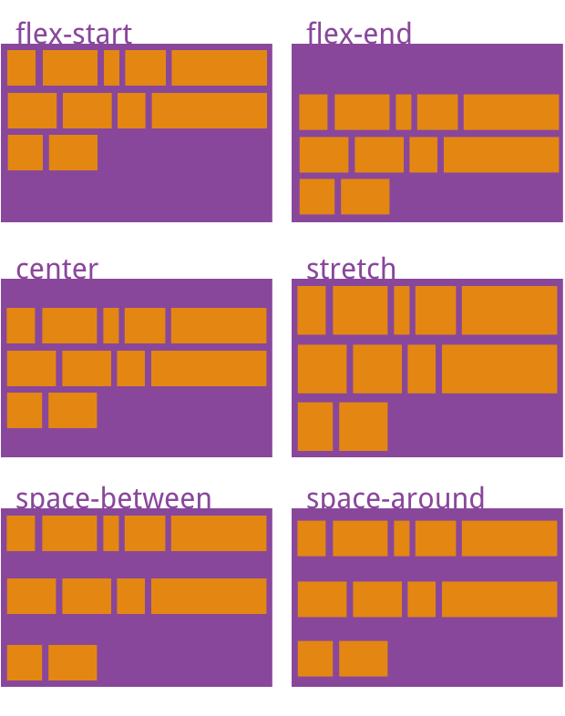

#### flex: 弹性布局

采用flex布局的元素称为flex容器, 它所有的子元素自动成为容器成员

容器中默认存在两根轴：

水平的主轴(main axis)
垂直的主轴(cross axis)
项目默认沿主轴排列，单个项目占据的主轴空间叫 main size

容器的属性:

1. 
flex-direction

 决定主轴的方向：row | row-reverse | column | column-reverse;
 
 row: 主轴为水平方向，起点在左端
 row-reverse: 主轴为水平方向，起点在右端。
 column:主轴为垂直方向，起点在上沿
 column-reverse:主轴为垂直方向，起点在下沿

2. 
flex-wrap

 决定主轴方向换行规则：nowrap | wrap | wrap-reverse;
 

 nowrap: 不换行
 wrap:  换行，第一行在上方。
 wrap-reverse: 换行，第一行在下方。

3. 
flex-flow

   flex-flow属性是flex-direction属性和flex-wrap属性的简写形式，默认值为row nowrap。

4. 
justify-content: 定义了项目在主轴上的对齐方式。(水平)

取值： flex-start | flex-end | center | space-between | space-around;

flex-start（默认值）：左对齐
flex-end：右对齐
center： 居中
space-between：两端对齐，项目之间的间隔都相等。
space-around：每个项目两侧的间隔相等。所以，项目之间的间隔比项目与边框的间隔大一倍。

5. 
align-items: 定义项目在交叉轴上如何对齐。

取值: flex-start | flex-end | center | baseline | stretch

flex-start：交叉轴的起点对齐。
flex-end：交叉轴的终点对齐。
center：交叉轴的中点对齐。
baseline: 项目的第一行文字的基线对齐。
stretch（默认值）：如果项目未设置高度或设为auto，将占满整个容器的高度

6. 
align-content: 多根轴线在垂直方向上的对齐

取值: flex-start | flex-end | center | space-between | space-around | stretch
  

flex-start: 与交叉轴的起点对齐
flex-end：与交叉轴的终点对齐
space-between：与交叉轴两端对齐，轴线之间的间隔平均分布。
center：与交叉轴的中点对齐。
space-around：每根轴线两侧的间隔都相等。所以，轴线之间的间隔比轴线与边框的间隔大一倍。
stretch（默认值）：轴线占满整个交叉轴。

#### 项目属性

1. order: 项目的排列顺序。数值越小，排列越靠前，默认为0
2. flex-grow: 定义项目的放大比例，默认为0，即如果存在剩余空间，也不放大。
3. flex-shrink: 定义了项目的缩小比例，默认为1，即如果空间不足，该项目将缩小
4. flex-basis: 定义了在分配多余空间之前，项目占据的主轴空间
5. flex: flex-grow, flex-shrink 和 flex-basis的简写，默认值为0 1 auto
6. align-self: 单个项目在垂直方向的对齐规则, 默认值为auto，表示继承父元素的align-items属性，如果没有父元素，则等同于stretch

