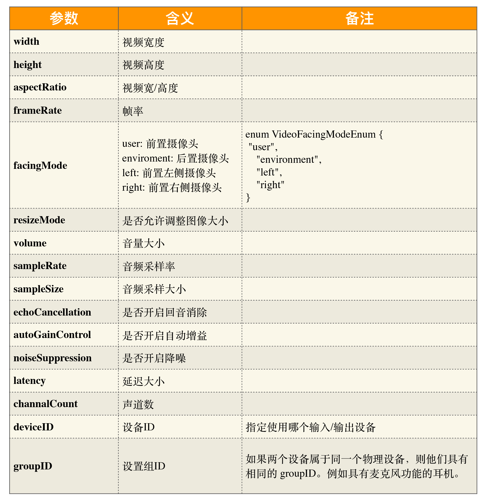

### 浏览器采集音视频流

```javascript

function getLocalMediaStream() {
 let localStream = null
 return navigator.mediaDevices.getUserMedia(constraints)
  .then((stream) => {
    localStream = stream
  },
  (error) => {
   console.log(error)
  }
 )
}
```

注意：

- navigator.mediaDevices.getUserMedia 返回的是promise对象

- getUserMedia接收入参为MediaStreamConstraints

```javascript
const mediaStreamContrains = {
 video: true, // 采集视频
 audio: true, // 采集音频
};

const mediaStreamContrains = {
 video: {
  frameRate: {min: 20}, 
  width: {min: 640, ideal: 1280},
  height: {min: 360, ideal: 720},
  aspectRatio: 16/9
 }
}
```



#### 如何实现将浏览器采集的音视频流渲染到页面上

``` javascript

initVideo = (srcObject) => {
 const video = document.createElement('video');
 video.srcObject = srcObject;
 document.body.appendChild(video);
}

const getMediaStream = () => {
 const constraints = {
   video: true,
   audio: true
 }
 let localStream = null;
 return navigator.mediaDevices.getUserMedia(constraints).then(
  (mediaStream) => {
   localStream = mediaStream
  },
 (error) => {
   console.error(error)
  })
 }

initLocalStream = async() => {
 const localStream = await getMediaStream()
 initVideo(localStream)
 }
```
