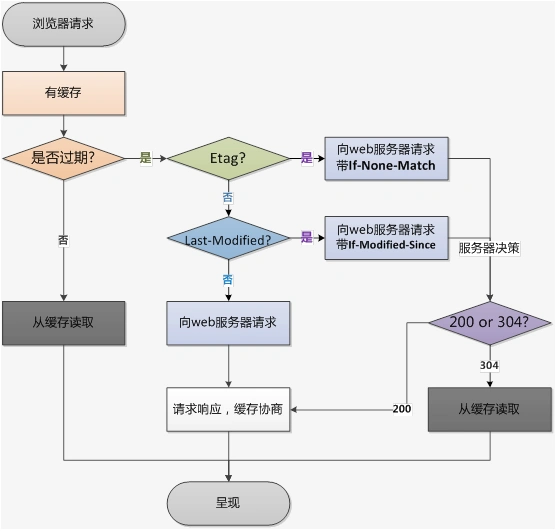

##### 什么是缓存？
缓存是一种保存资源副本并在下一次请求时直接使用该副本的技术


###### 强缓存

cache-control: 

1. no-store: 不缓存， 每次请求都重新加载
2. no-cache： 缓存但是重新校验， 请求发出后会将此请求发到服务器，服务端验证缓存是否过期，如未过期就会使用本地缓存副本（304）-> 服务端验证是否过期走的是协商缓存的验证
3. public： 该响应被任何的中间件（cdn、代理）缓存
4. private: 只能针对个人用户

5. max-age=<seconds>: 缓存时间
6. s-maxage: 和 max-age一样，只不过是针对代理服务器而言
7. max-stale: 愿意接收过期资源， 响应不能已经过时超过该给定的时间
8. min-fresh: 希望获取一个在指定秒数内罪行状态的响应

9. must-revalidate: 资源过期，缓存不能用


Expires：<http-date> 服务器返回的过期时间
工作原理： 下一次请求时，请求时间小于服务端返回的到期时间直接使用缓存数据

cache-control 和 Expires 的区别是啥？
Expires是http1.0的产物； cache-control是http1.1的产物

###### 协商缓存

last-Modified / If-Modified-Since

```flow
st=>start: 客户端发起请求
browserCache=>condition: 判断是否有缓存
isCache=>inputoutput: 读取缓存数据

noCache=>inputoutput: 没有缓存数据
fetchHttp=>operation: 发起http请求， 响应头决定缓存机制，下发 last-modified
responseData=>operation: 浏览器缓存last-modified的值
useLastModified=>operation: 下一次请求头上会带上 If-Modified-Since,值为上一次last-modified的值
isNotExpires=>condition: 服务器会根据 If-Modified-Since 判断是否被修改过
notModified=>operation: 没有被修改过，返回304， 浏览器不下载响应头
isModified=>operation: 修改过，浏览器重新缓存
e=>end

st->browserCache
browserCache(yes)->isCache->e
browserCache(no)->noCache->fetchHttp->responseData->useLastModified->isNotExpires
isNotExpires(yes)->isModified->e
isNotExpires(no)->notModified->e
```

ETag 和 If-None-Match

和last-modified类似， 不同点在于服务器返回的是一个tag标识符， 在一次请求的时候会带上 If-None-Match 的请求头



两者区别：

ETag 优先级高于 last-modified