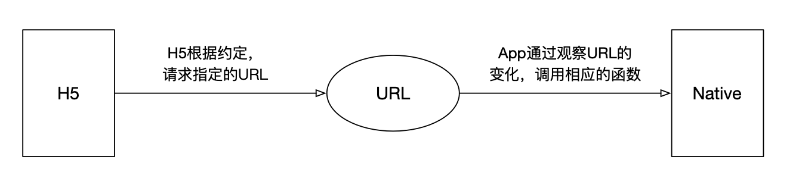
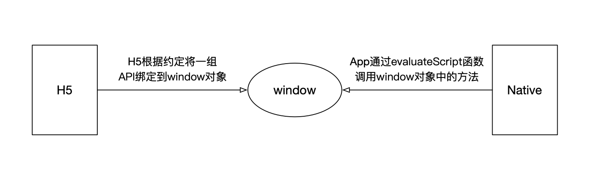

#### Webview 是一个基于webkit的引擎，可以解析DOM 元素，展示html页面的控件，它和浏览器展示页面的原理是相同的，所以可以把它当做浏览器看待

#### webview: 是一个可加载网页的对象, 类似于浏览器的功能

#### h5 调用 native

1. ios下的 uiwebview 和 wkwebview

uiwebview和wkwebview能够拦截h5内发起的网络请求； 在h5内发起约好的特定协议的网络请求带上需要传递給ios的参数, 客户端拦截到指定协议请求后解析url上的参数

1. 网络拦截
 

2. native想webview中注入全局变量并挂载到window上

---

#### native 调用 h5

1. h5根据约定将一组API绑定到window对象上， native通过evaluateJavaScript函数调用window对象中的方法



#### 通信实现

##### h5调用native

1. 通过拦截url的形式(更加类似于jsonp)

```javascript

  class JSBridge {
    constructor() {
        this.callback = [];
    }

    initIframe(module, params) {
        const iframe = document.createElement('iframe');
        iframe.style.display = 'none';
        const value = JSON.parse(params);
        const src = `myiframe://mathod=${module}?param=${value}`;
        iframe.src = src;
        document.body.appendChild(iframe);
    }

    /**
     * h5调用native
     */
    invokeNative(module, params, handler) {
        this.callback.push({ module, params, handler });
        this.initIframe(module, params);
    }

    /**
     * native 调用 h5, evaluateJavascript
     */
    invokeH5(module, params) {
        this.callback
            .filter((item) => item.module === module)
            .forEach((item) => {
                const { handler } = item;
                handler(params);
            });
    }
}

```

2. native注入上下文

```javascript

 const bridge =
    window.bridge ||
    (function() {
        const result = {
            call, // H5调用native
            response, //native调用js
            pf: null,
            enable: false,
        };

        let nativeBrigge = null;

        const callback = {};

        const bridgeAndroid = window.bridgeAndroid;
        const bridgeIOS = window.bridgeIOS;

        if (bridgeAndroid) {
            nativeBrigge = bridgeAndroid;
            result.pf = 'android';
            result.enable = true;
        } else if (bridgeIOS) {
            nativeBrigge = bridgeIOS;
            result.pf = 'ios';
            result.enable = true;
        }

        const lastCallId = Date.now();

        function initCallbackId() {
            return `birdge:${lastCallId}`;
        }

        // js 调用native方法
        function call(module, params, success, failure, once = true) {
            const callId = initCallbackId();
            callback[callId] = {
                module,
                params,
                success,
                failure,
                once,
            };
            const data = JSON.stringify({ module, params, callId });
            if (result.pf === 'android') {
                nativeBrigge.call(data);
            } else if (result.pf === 'ios') {
                nativeBrigge.postMessage(data);
            }
        }

        // native调用js代码
        function response(params) {
            const { callId, erroCode, error, data } = params;
            const item = callback[callId];
            if (!item) return;
            const { success, failure, once } = item;
            if (erroCode === -1) {
                failure(error);
            } else {
                success(data);
            }
            if (once) {
                delete callback[callId];
            }
        }

        return (window.bridge = bridge);
    })();
```
