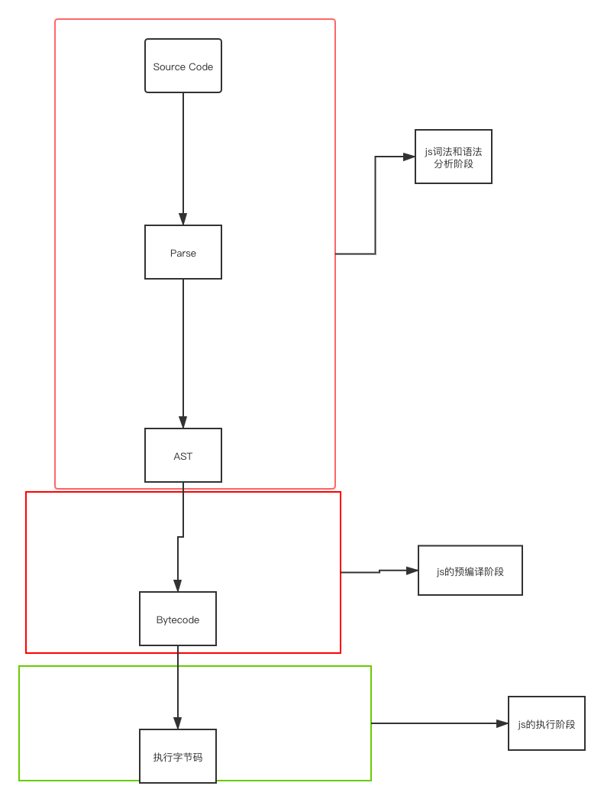
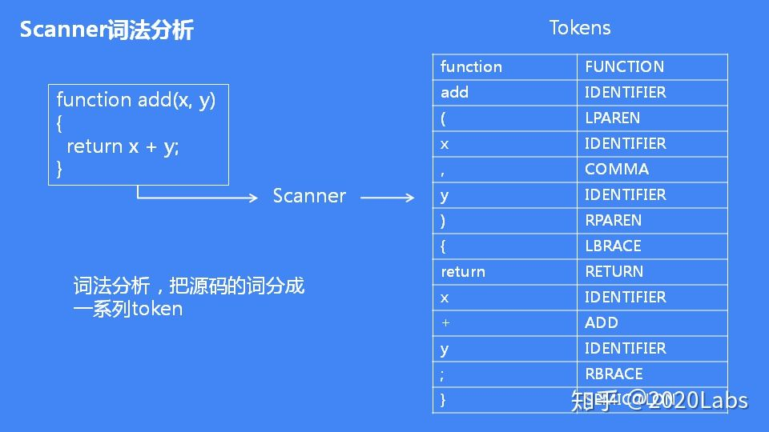
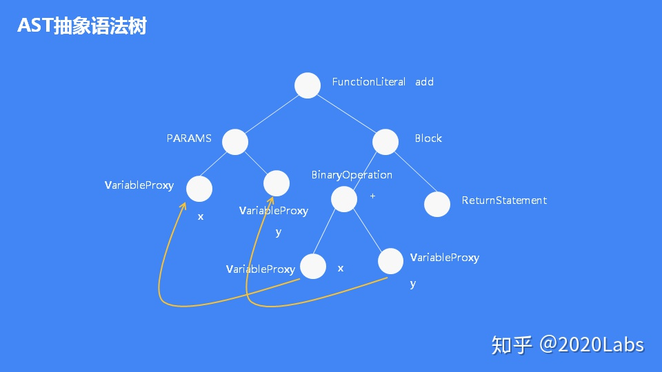
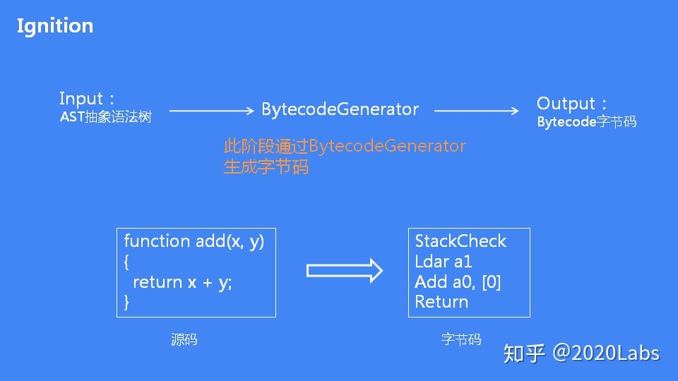

### js引擎的执行流程

[参考资料](https://zhuanlan.zhihu.com/p/96969423)
[js引擎](https://juejin.im/post/6844903788629721096)

- js的词法分析

   JS文件只是一个源码，机器是无法执行的，词法分析就是把源码的字符串分割出来，生成一系列的token

   

- 词法分析完后，接下来的阶段就是进行语法分析。语法分析语法分析的输入就是词法分析的输出，输出是AST抽象语法树。当程序出现语法错误的时候，V8在语法分析阶段抛出异常

    

v8引擎解阶段分为预解析和代码执行两阶段， 在预解阶段会有变量预解析和函数预解析

- js的字节码生阶段， 根据抽象语法树生成字节码

   

- 字节码的阶段
