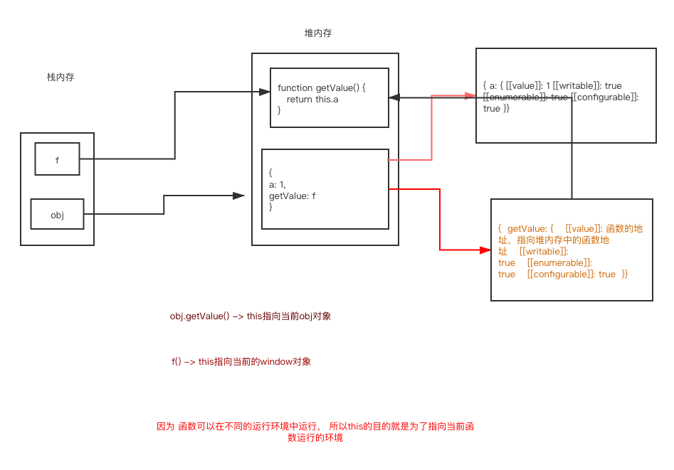

js的内存结构

    ```javascript
     var obj = { a: 1}
    ```

  将一个对象赋值给obj变量，js引擎会先在队内存中生成一个对象，然将堆内存的地址赋值给变量obj， 所以实际上变量obj指向的是一个堆内存地址

   <p style="color: red;">也就是说，变量obj是一个地址（reference）。后面如果要读取obj.a，引擎先从obj拿到内存地址，然后再从该地址读出原始的对象，返回它的a属性</p>

   ```javascript
    var f = function() {
        return this.a
    }
    var obj = {
         a: 1,
         getValue: function() {
             return this.a
         }
     }
    f() // undefined
    obj.f() // 1
   ```

