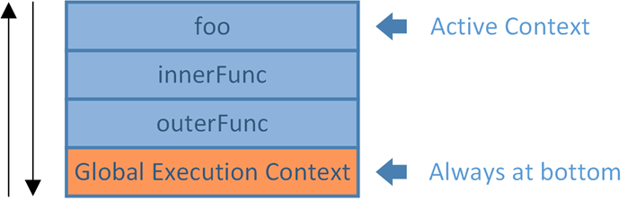

##### js之执行上下文

在JavaScript中有三种代码运行环境

- Global Code: JavaScript代码开始运行的默认环境
- Function Code: 代码进入一个JavaScript函数
- Eval Code: 使用eval()执行代码

js 代码被执行的时候进入不同的执行环境，这些执行环就构成了执行环境栈（Execution context stack，ECS）



<p style="color: red; font-size: 18px;">对于每个Execution Context都有三个重要的属性，变量对象（Variable object，VO），作用域链（Scope chain）和this</p>

- VO(variable object):变量对象， 包含当前执行环境的<span style="color: red;">变量 (var, Variable Declaration)， 函数声明 (Function Declaration, FD)， 函数的形参</span>

        ```javascript
            function VariableObject() {
                this.variableDeclaration = {}  // 变量声明
                this.functionDeclatration = {} // 函数声明
                this.functionArguments = {} // 函数的形参
            }
        ```

    VO: 对象中不包含函数表达式和没有使用var声明的变量

- 作用域

- this属性

活动对象（Activation object）
在函数上下文执行中， vo是不能直接访问的， 此时由激活的对象AO扮演vo角色，激活对象进入函数上下文时被创建， 它是通过函数的arguments属性

Arguments Object对象包含：

- callee: 指向当前函数的引用
- length: 真正传递的参数个数
- properties-indexes：就是函数的参数值(按参数列表从左到右排列)

执行环境的创建分为创建阶段和激活/代码执行阶段

- 创建阶段（当函数被调用，但是开始执行函数内部代码之前）
  - 创建Scope chain
  - 创建VO/AO（variables, functions and arguments）
  - 设置this的值

- 激活/代码执行阶段
  - 设置变量的值、函数的引用，然后解释/执行代码

- 创建VO/AO

    1. 根据函数的参数，创建并初始化arguments object

    2. 扫描函数内部代码，查找函数声明（Function declaration）
        a. 对于所有找到的函数声明，将函数名和函数引用存入VO/AO中
        b. 如果VO/AO中已经有同名的函数，那么就进行覆盖

    3. 扫描函数内部代码，查找变量声明（Variable declaration）

```javascript
    // 创建执行环境
    function CreateExecutionContext() {
        this.status = 'created'
        if (this.status === 'created') {
            CreatedScopeChin() // 创建作用域连
            VariableObject() // 创建VO或者AO对象
            SetCurrentThisValue() // 设置当前this的值
        }
    }

    function demoExecutionContext(param1, param2) {

        function demo() {
            console.log('测试')
        }

        var demo = 'created'

        var a = '测试'
    }

    demoExecutionContext('ryfrgyfrgyfr', '参数以')

    // 创阶段
    demoExecutionContextCreated{
        scopeChain: {},
        VO: {
            arguments: {
                0: ' ryfrgyfrgyfr ',
                1: '参数以' 
            },
            param1: ' ryfrgyfrgyfr',
            param2: '参数以',
            demo: point to function demo(){.....},
            a: undefined
        },
    }

    // 执阶段
    demoExecutionContextExe{
       scopeChain: {},
        VO: {
            arguments: {
                0: ' ryfrgyfrgyfr ',
                1: '参数以' 
            },
            param1: ' ryfrgyfrgyfr',
            param2: '参数以',
            demo: 'created',
            a: '测试' 
        }, 
    }
`
