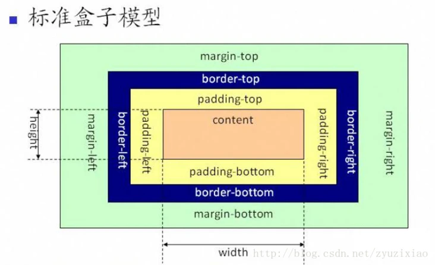

#### 什么是盒子模型？
页面所呈现的效果就是一个一个盒子堆砌而成
盒模型由margin + padding + border + content组成

#### CSS的盒模型分类

###### 标准盒模型： content = content



如何设置为标准盒模型？

```css
box-sizing:content-box;
```
###### IE 盒模型： content = content + border + padding


如何设置为IE盒模型？
```css
box-sizing:border-box;
```

 ```javascript
dom.style.width/height
dom.currentStyle.width/height  (ie支持)
window.getComputedStyle(dom).width/height;
dom.getBoundingClientRect().width/height;
 ```
